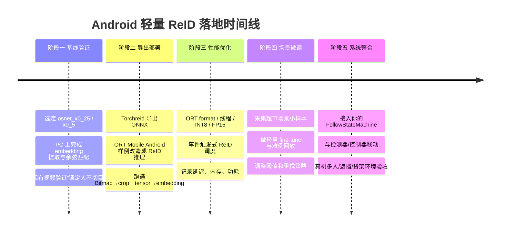

# Android 端轻量 ReID 与多目标跟踪部署分析报告

## 执行摘要

针对“超市/商场内单目标跟随”的 Android 端落地，我的结论是：**首选路线不是直接把 DeepSORT 或完整 ByteTrack 官方仓库硬搬到手机上，而是采用 `检测器 + 轻量单目标跟踪状态机 + 按需触发 ReID` 的工程组合**。在 ReID 模型上，**OSNet 系列，尤其是 `osnet_x0_25` 与 `osnet_x0_5`，是当前最值得优先验证的轻量方案**：它们在 Torchreid 官方模型库中以极低参数量和 GFLOPs 提供了显著强于 MobileNetV2 ReID 变体的 ReID 精度；如果你更重视跨场景泛化，可再考虑 `osnet_ain_x1_0` 这类加入 instance normalization 的变体。citeturn32academia0turn32academia3turn51view0turn51view1turn51view2turn51view5

在 Android 部署路径上，**推荐优先级**是：  
**第一选择：PyTorch/Torchreid → ONNX → ONNX Runtime Mobile（推荐）**；  
**第二选择：PyTorch → LiteRT Torch 直接导出 `.tflite`（值得试，但当前仍处 Beta，且转换器环境以 Linux 为主）**；  
**第三选择：PyTorch/Torchreid → ONNX → 第三方 onnx2tf → TFLite/LiteRT（可行但维护负担更高）**。之所以推荐 ORT Mobile 优先，是因为 Torchreid 已有官方 ONNX 导出脚本，ONNX Runtime Mobile 官方文档与 Android 示例更成熟，而且 ORT 支持 ORT format、量化、线程与 NNAPI 优化，整体更适合作为首版产品化路径。citeturn38view3turn53view0turn53view4turn16view3turn22view0turn50view3

在多目标跟踪框架选择上，**ByteTrack 更适合作为“运动关联骨架思想”借鉴，DeepSORT 更像“学术上完整但移动端包袱更重的旧范式”**。DeepSORT 的优点是自带外观特征关联、Kalman + IoU + 外观三者闭环；缺点是官方仓库依赖 TensorFlow 1.5 的旧 `mars-small128.pb` 流程，且仓库为 GPL-3.0，若直接复用到商业或封闭分发 App，需要非常谨慎评估许可证。ByteTrack 则是 MIT 许可证，关联思想简单有效，且官方仓库明确支持 ONNX Runtime、TensorRT、ncnn 等部署方向；但它默认并不提供你这个“顾客重识别记忆”场景中最关键的强外观记忆能力，因此更适合和你自己的 ReID/TargetMemory 结合。citeturn9academia1turn55view0turn55view1turn55view3turn55view4turn56view0turn56view1turn56view4

如果你的目标是**首版、离线、本地推理、无 Google Play Services 依赖**，那么建议路线可以非常明确：  
**检测沿用现有人检测模型**；  
**跟踪主体采用 ByteTrack/DeepSORT 思想的轻量自研 tracker**；  
**ReID 首版用 `osnet_x0_25` 或 `osnet_x0_5`，只在初始化、丢失重找、多人混淆时触发**；  
**Android 端推理优先 ORT Mobile，模型先做 ONNX，再做静态量化或 FP16/ORT format 测试**；  
**如果手机性能或转换兼容性不理想，就退回“颜色直方图 + 位置/运动 + 低频 ReID”混合方案**。citeturn26view1turn26view7turn27view1turn29view2turn31view0

## 技术版图与模型比较

### OSNet 与 Torchreid

OSNet 的核心思想是“**omni-scale**”特征学习：网络显式建模多尺度与多尺度组合的判别信息，同时通过轻量化设计控制参数量与计算量，因此它在 ReID 任务上属于**少数真正兼顾精度与轻量性**的专用架构。Torchreid 则是 OSNet 的官方/主要开源训练与评估生态之一，支持 ReID 训练、评估、模型导出，并在 2022 年加入了 ONNX / OpenVINO / TFLite 导出能力。citeturn32academia0turn38view3turn53view0turn53view4

Torchreid 的另一个价值在于：它不仅给出同域精度，还给出跨域与多源泛化结果。对你这种“固定超市但人流复杂、服饰多样、遮挡频繁”的现实场景，**跨域泛化能力比公开 benchmark 高分更重要**。Torchreid 文档明确指出真实应用中跨域 ReID 很关键，并给出 cross-domain 训练建议；例如在跨域设置下，相比单纯 `random_erase`，`color_jitter` 等增强更有利于泛化。citeturn44view1

### MobileNetV2 ReID

MobileNetV2 不是为 ReID 专门设计的，但它具有**移动端部署成熟、算子简单、转换路径普适**的优势，因此在 ReID 项目里常被当作轻量 backbone。针对 ReID，公开研究表明 MobileNetV2 的混合精度/边缘部署有较高实时潜力，但在识别精度上通常仍弱于专用 ReID 架构。特别是在 Torchreid Model Zoo 中，`mobilenetv2_x1_0` 与 `mobilenetv2_x1_4` 的 ReID 结果明显落后于同级别的 OSNet 变体。citeturn35academia3turn36view0turn51view2turn51view3turn51view4

### 模型对比表

下表优先比较**你真正可能放到手机里**的几种轻量 ReID 选择。表中参数量与输入尺寸优先来自 Torchreid 官方 Model Zoo；`osnet_ain_x1_0` 的“优点/推荐场景”结合其官方跨域结果。citeturn51view0turn51view1turn51view2turn51view3turn51view4turn51view5

| 模型 | 参数量 | 输入尺寸 | 优点 | 缺点 | 推荐场景 |
|---|---:|---:|---|---|---|
| `osnet_x0_25` | 0.2M citeturn51view0 | 256×128 citeturn51view0 | 极轻；非常适合手机；以极低成本保留专用 ReID 结构优势 | 极限场景下鲁棒性不如更大模型 | 首版 Android 验证、低频 ReID、多人但算力紧张 |
| `osnet_x0_5` | 0.6M citeturn51view1 | 256×128 citeturn51view1 | **最推荐的精度/体积平衡点**；比 MobileNetV2 ReID 更强 | 仍需做实机量化与延迟测试 | 你的主推候选，适合顾客跟随与遮挡重找 |
| `osnet_x1_0` | 2.2M citeturn51view4 | 256×128 citeturn51view4 | 精度更高，仍算轻量 | 相比 x0.5 增益未必值得移动端成本 | 中高端手机、你需要更稳的重识别时 |
| `osnet_ain_x1_0` | 2.2M citeturn51view5 | 256×128 citeturn51view5 | 跨域泛化更强，适合光照/相机/场景变化 | 体量与 x1.0 相同，移动端成本较高 | 若后续要跨店/跨设备/跨机位推广 |
| `mobilenetv2_x1_0` | 2.2M citeturn51view2 | 256×128 citeturn51view2 | 部署友好、算子简单、转换兼容性通常更好 | ReID 专用性弱，官方 ReID 结果低于 OSNet | 当 OSNet 转换/兼容遇坑时的保守备选 |
| `mobilenetv2_x1_4` | 4.3M citeturn51view3 | 256×128 citeturn51view3 | 较 x1.0 有一定 ReID 提升 | 参数更多，但仍未追上 OSNet x1.0 | 只在你坚持 MobileNet 路线时考虑 |

直接从官方 Model Zoo 的同域结果看，`osnet_x0_5` 以 **0.6M 参数 / 0.27 GFLOPs** 达到了显著高于 `mobilenetv2_x1_0` 的 ReID 表现；`osnet_x0_25` 也以 **0.2M / 0.08 GFLOPs** 保留了不错的识别能力。这说明**如果目标是“手机上做人重识别”，OSNet 家族的单位计算收益明显更高**。citeturn51view0turn51view1turn51view2turn51view4

我的建议很明确：  
**首测模型：`osnet_x0_25` 与 `osnet_x0_5`；**  
**若多人密集、衣着相似、重找失败率高：升到 `osnet_x1_0`；**  
**若你未来不是只做一个超市、一台手机：补测 `osnet_ain_x1_0`。** citeturn51view5

## 多目标跟踪框架与工程可移植性

### DeepSORT

DeepSORT 是 SORT 的增强版：在 Kalman 运动模型与 IoU 关联基础上，引入深度外观特征，使跟踪器在遮挡、交叉、短时丢失时更不容易 ID switch。论文报告称其相对原 SORT 带来了显著的 identity switch 降低；官方仓库也清晰分出 `kalman_filter.py`、`linear_assignment.py`、`iou_matching.py`、`nn_matching.py`、`tracker.py` 等模块。citeturn9academia1turn55view4

但从 Android 工程角度看，DeepSORT 官方仓库有三点明显不利：  
其一，仓库官方流程绑定了 **TensorFlow 1.5** 与 `mars-small128.pb`；  
其二，外观描述子流程围绕离线 `.npy` 检测文件与 128 维外观向量展开；  
其三，仓库许可证是 **GPL-3.0**。这意味着它更适合作为算法参考，而不是直接复制到一个准备产品化的 Android App 里。citeturn55view0turn55view1turn55view2turn55view3

如果你要借用 DeepSORT，**更合理的做法是借它的“结构”，不要搬它的代码**：  
保留它的状态机逻辑——Kalman 预测、门控、IoU 匹配、外观余弦距离；  
但把外观网络换成你自己的 OSNet/MobileNetV2 ReID embedding，在 Android 上直接计算余弦相似度。这样可以避开 TF1 与 GPL 包袱。citeturn55view3turn55view4

### ByteTrack

ByteTrack 的核心创新在于：**不只关联高分框，而是把低分检测框也纳入关联流程**，用它们与现有 tracklet 的相似性来“捞回”真实目标。这个思路对你非常有价值，因为“目标被货架边缘遮挡、顾客转身、检测置信度下降”恰恰是超市场景的常态。citeturn56view1turn9academia2

从工程上看，ByteTrack 官方仓库更友好：  
它是 **MIT 许可证**；  
官方 README 明确给出安装、训练、跟踪、Demo、Deploy 路线，并且部署章节直接列出 **ONNX export + ONNX Runtime、TensorRT、ncnn、Deepstream** 等方向；  
同时官方示例也显示 `BYTETracker` 可以作为一个相对独立的 tracker 类被嵌入调用。citeturn56view0turn56view3turn56view4

但也要现实一点：**ByteTrack 官方仓库本体并不适合直接移植到手机端 App**。因为它大量围绕 Python、YOLOX 训练/评测、数据集处理、pycocotools 等构建，真正适合 Android 的不是整个仓库，而是它的**关联思想与状态更新逻辑**。citeturn56view3turn56view4

### 你的场景下应该怎么选

对于“**只跟一位经用户确认的顾客**”这个单目标任务，最佳实践不是把 DeepSORT 或 ByteTrack 当成完整 black box，而是：

- **检测器**：保留你已在 OpenBot/现有链路中跑通的人检测器。  
- **跟踪骨架**：借鉴 ByteTrack/DeepSORT 的 Kalman + IoU + 置信度门控逻辑。  
- **外观记忆**：由你自己的 ReID 模型提供 embedding，并保存在 `TargetMemory` 中。  
- **触发策略**：不是每帧都跑 ReID，而是在“初始化、多人混淆、目标丢失重找、周期刷新”时才跑。  

这样做的原因很简单：**ByteTrack 让你在检测抖动时不轻易丢目标，ReID 让你在人群中不跟错人**。二者结合，才是适合“跟随购物车”的实战路径。citeturn56view1turn55view4

## 从 PyTorch 和 Torchreid 到 Android 的部署路径

### 推荐主线

我建议把部署主线定为：

**Torchreid 训练/加载权重 → 导出 ONNX → ONNX Runtime Mobile Android 集成 → 量化/ORT format/线程优化 → Android 端 embedding + 余弦相似度后处理。**

原因有四个：

第一，Torchreid 官方仓库已明确加入导出能力，并提供 `tools/export.py`。citeturn38view3turn53view0

第二，`tools/export.py` 已支持 `--weights`、`--imgsz`，默认输入就是 ReID 常见的 `256×128`，并默认提供 `onnx / openvino / tflite` 导出选项。citeturn53view0turn53view2

第三，ONNX Runtime Mobile 官方明确支持 Android，且官方 Android 教程与 `onnxruntime-inference-examples` 仓库都给出了完整移动端示例。citeturn16view3turn22view0turn39view0

第四，ONNX Runtime Mobile 支持 ORT format、量化、线程调优，并能结合 NNAPI 等执行提供器；这些都非常适合你后续做手机端性能收敛。citeturn27view1turn27view2turn26view1turn26view5turn26view6

### 路线一

#### Torchreid 到 ONNX 到 ONNX Runtime Mobile

Torchreid 的 `export.py` 中，ONNX 导出调用了 `torch.onnx.export`，默认导出时给输入命名为 `images`，输出命名为 `output`，并允许动态 batch 轴；命令行参数中 `--weights`、`--imgsz`、`--include` 都已封装好。citeturn53view3turn53view4turn53view0

这条路线的优势是最稳：

- 训练/评估继续在 PyTorch/Torchreid。citeturn38view3
- 模型导出走官方 ONNX。citeturn53view4
- Android 端推理走 ORT Java/Kotlin API。  
- 模型还可进一步转成 ORT format，使之更适合移动端 size-constrained 环境；官方文档明确指出 ORT format 适用于 reduced size ONNX Runtime 构建，并支持 Android Java/Kotlin API 加载。citeturn27view1turn27view2turn50view3

如果你只想要**最快跑通首版 Android ReID**，这条路线优先级最高。

### 路线二

#### PyTorch 到 LiteRT Torch 直接到 TFLite

Google AI Edge 官方的 `litert-torch`（即原 `ai-edge-torch`）已经把“**从 PyTorch 模型直接转换到 `.tflite`**”作为核心能力之一，并给出 `litert_torch.convert(model.eval(), sample_inputs)` 的示例。仓库 README 还明确说明：它用于把 PyTorch 模型转成 LiteRT/TFLite，以便在 Android、iOS 与 IoT 上本地运行。citeturn31view0

但这里要注意三点：

- 它当前的 **PyTorch converter 还是 Beta**。citeturn31view0
- README 中安装环境以 **Linux** 为主，并建议 Python 3.11。citeturn31view0
- 它强调基于 `torch.export()` 与 Core ATen operator 覆盖，因此**Torchreid 的具体模型算子是否 100% 顺滑转换，需要你先做兼容性 smoke test**。citeturn31view0

所以这条路线非常有潜力，但我会把它放在**“第二阶段并行验证”**，而不是首版绝对主线。

### 路线三

#### ONNX 到第三方 onnx2tf 再到 TFLite

如果你坚持 TFLite/LiteRT，并且 LiteRT Torch 暂时不兼容你的 Torchreid 模型，那么 `onnx2tf` 是一条实用但更依赖第三方维护的路线。该项目明确宣称支持把 ONNX 转成 LiteRT/TFLite/TensorFlow，且仓库 MIT 许可证、维护较活跃。citeturn42view0

不过这条路线的风险是：  
转换链更长；  
排错时你要同时面对 ONNX、TensorFlow、TFLite 侧的问题；  
而且与 Torchreid 官方导出脚本相比，它不属于你当前主生态的“同一作者栈”。因此它适合作为**兼容性兜底**，不适合作为一开始的最短路径。citeturn42view0

### Android 集成细节

对于 Android 端，你至少要保证四件事一致：

- **输入裁剪一致**：用检测框从原图裁出人框。  
- **输入尺寸一致**：Torchreid/Model Zoo 主流输入为 `256×128`。citeturn51view0turn51view1turn51view2
- **预处理一致**：RGB/BGR、缩放、归一化方式要与你训练/导出脚本严格一致。  
- **输出后处理一致**：embedding 的维度、归一化方式、相似度计算方式（余弦/L2）必须与训练/验证约定一致。DeepSORT 官方仓库就是用余弦相似度做外观比较；Torchreid Cross-domain 表中也明确展示了 cosine distance 的使用。citeturn55view3turn51view5

下面给一个 Android 侧最小化的 ORT 调用示意。这个代码是结构示例，不绑定具体模型维度：

```kotlin
// Kotlin / ONNX Runtime Mobile
val env = ai.onnxruntime.OrtEnvironment.getEnvironment()
val session = env.createSession(modelBytes)

val inputName = session.inputNames.iterator().next()
val inputBuffer: FloatBuffer = preprocessCropToCHWFloat(cropBitmap, 256, 128)
val shape = longArrayOf(1, 3, 256, 128)

OnnxTensor.createTensor(env, inputBuffer, shape).use { inputTensor ->
    session.run(mapOf(inputName to inputTensor)).use { result ->
        val embedding = (result[0].value as Array<FloatArray>)[0]  // 1 x D
        val score = cosineSimilarity(embedding, targetMemory.embedding)
        // 根据 score + IoU + motion 做最终匹配
    }
}
```

如果你后续发现 Java/Kotlin 端的预处理或余弦相似度成为热点，再把“裁剪/resize/normalize/embedding compare”下沉到 JNI；**首版没有必要一开始就上 JNI**。

## 移动端优化、性能判断与开源案例

### 量化与混合精度

如果你走 ONNX Runtime，官方推荐对 CNN 模型优先考虑 **static quantization**，因为静态量化使用校准集离线估计激活量化参数，更适合 CNN；动态量化更偏向 RNN/Transformer。ORT 官方还提供 `quantize_dynamic` / `quantize_static()` 路径。citeturn26view0turn26view1

在 ONNX Runtime 里，FP16 也是很值得测试的路线。官方文档指出：把模型从 float32 转成 float16，**模型大小最多可以接近减半**，且在某些 GPU 上会提升性能；若纯 float16 损失过大，还可以使用 mixed precision，把部分算子保留在 float32。citeturn26view7turn26view8

如果你走 LiteRT/TFLite，官方文档同样把 post-training quantization 作为核心优化入口，并支持 GPU/NPU 加速。需要注意的是，TFLite/LiteRT 的 GPU delegate 在存在“不支持算子”时可能出现**图被分割执行**，这会带来同步与内存搬运开销，某些模型上反而可能变慢；因此不要假设 GPU 一定优于 CPU，必须实机 benchmark。citeturn29view2turn49view2turn15view4

### 线程、ORT format 与执行提供器

ORT 在移动端还有三个很实用的点：

- **线程数可控**：`intra_op_num_threads`、`inter_op_num_threads` 可调。citeturn26view5turn26view6
- **ORT format**：更适合 size-constrained 场景，可与 reduced operator build 配合。citeturn27view1turn50view3
- **优化风格**：官方建议使用 NNAPI/CoreML 时更偏向 `Runtime` style，固定 CPU 路径则可优先 `Fixed`。citeturn50view1turn50view2

对于你这个项目，我建议的优化顺序是：

1. 先跑通 FP32。  
2. 再测 ORT format。  
3. 再测静态 INT8。  
4. 再测 FP16 / GPU / NNAPI。  
5. 最后再做线程和帧率调度微调。  

### 事件触发式 ReID

这里给出一个非常重要的工程建议：**不要每帧都跑 ReID**。

真正高性价比的做法是：

- 初始化锁定目标时：连续跑 3～10 帧，取平均 embedding。  
- 正常跟随阶段：只跑检测+轻量 tracker，ReID 每 0.5～1 秒低频刷新一次。  
- 多人靠近/遮挡/丢失重找阶段：临时提升为每帧或每 2 帧跑一次 ReID。  
- 找回目标后：再恢复低频。  

这样做的直接收益是：既保住 ReID 的“谁是目标”能力，又不让它成为整个系统的帧率瓶颈。ByteTrack 解决的是“连续帧关联”，ReID 解决的是“身份确认”，它们不应该被设计成同频率重算。citeturn56view1turn55view4

### Android 上可参考的开源案例

下面列出**我认为对你最有复用价值**的仓库/样例，不只限于“现成 ReID Android Demo”，而是“你真正能拿来拼出 ReID Android 方案”的材料。

| 项目 | 作用 | 复用价值 | 许可证 |
|---|---|---|---|
| `KaiyangZhou/deep-person-reid` citeturn38view3 | Torchreid / OSNet 训练、评估、导出 | **最高**；你的 ReID 主仓库 | MIT citeturn38view0 |
| `microsoft/onnxruntime-inference-examples` citeturn39view0 | ORT 官方 Android 样例 | **最高**；直接改造成 ReID App 骨架 | MIT citeturn39view0 |
| `google-ai-edge/litert-torch` citeturn31view0 | PyTorch → TFLite/LiteRT 官方转换器 | 高；值得并行验证 TFLite 路线 | Apache-2.0 citeturn31view0 |
| `FoundationVision/ByteTrack` citeturn56view0 | 多目标跟踪骨架思想 | 高；适合借关联逻辑、自研轻 tracker | MIT citeturn56view0 |
| `nwojke/deep_sort` citeturn55view0 | DeepSORT 参考实现 | 中；借思路，不建议直接搬代码 | GPL-3.0 citeturn55view0 |
| `isl-org/MiDaS` 官方 mobile 子目录 citeturn45view0 | Android/iOS 单目深度移动样例 | 高；对你后续距离/障碍感知很有参考价值 | MIT，仓库已归档 citeturn40view0turn45view0 |
| `TeCSAR-UNCC/person-reid` citeturn36view0 | MobileNetV2 / mixed precision ReID 研究代码 | 中；更适合看训练与导出思路 | 许可证需单独核查 citeturn36view0 |
| `PINTO0309/onnx2tf` citeturn42view0 | ONNX → TFLite/LiteRT 第三方转换 | 中；作为转换失败时的兜底通道 | MIT citeturn42view0 |

其中最值得特别指出的是 **MiDaS 官方移动样例**。它不仅真的提供了 Android/iOS 移动端目录，而且在 OnePlus 8 上给出了公开速度参考：新 small 模型在 Android 上约 **6 FPS CPU / 22 FPS GPU / 4 FPS NNAPI**。这对你非常有价值，因为它证明了两件事：  
一是“手机本地深度/视觉模型”完全可做；  
二是“**NNAPI 并不总比 GPU 更快**”，所以后续做 ReID 也一定要实机逐个 delegate 测。citeturn45view0

### 对 Android 端 ReID 延迟的保守预估

严格说，**公开、可直接对齐的 Android ReID 延迟 benchmark 很少**。因此下面给的是**工程估算**，不是权威官方数值：

- `osnet_x0_25`：中高端 Android，单 crop 256×128，batch=1，**CPU FP32 约 10–25 ms**；合理量化/委托后有机会落到 **5–15 ms**。  
- `osnet_x0_5`：**CPU FP32 约 15–35 ms**；优化后争取 **8–20 ms**。  
- `mobilenetv2_x1_0` ReID：**CPU FP32 约 10–30 ms**；优化后 **5–18 ms**。  

这个量级判断主要是基于 Torchreid 给出的参数量/GFLOPs、ORT/LiteRT 的移动执行能力、以及 MiDaS 官方 Android 公开数据作出的保守推断；真正结果必须以你的目标手机为准。citeturn51view0turn51view1turn51view2turn45view0turn26view7turn27view1

## 推荐的工程实施方案

### 总体建议

结合你的项目目标，我建议分成下面几个阶段推进。



### 阶段产出与验收标准

**阶段一：PC 侧 ReID 基线**
- 产出：  
  - `osnet_x0_25` 与 `osnet_x0_5` 的 embedding 提取脚本。  
  - 目标初始化（3～5 张 crop 平均 embedding）。  
  - 余弦相似度 + IoU + 运动先验混合评分器。  
- 验收：  
  - 同一目标跨 1～3 秒短遮挡后可重找。  
  - 2～5 人画面中不因“最大框变化”而切目标。  
  - 输出日志中能看到 `score_reid / score_iou / score_motion / final_score`。  

**阶段二：Android 首版部署**
- 产出：  
  - ORT Mobile Android demo 模块。  
  - `Bitmap → crop → resize(256×128) → FloatTensor → embedding` 全链路。  
  - 屏幕 overlay 输出“当前匹配目标/重找中/不确定”。  
- 验收：  
  - 单帧 ReID 推理稳定运行，无崩溃。  
  - 可在手机相机实时视频中对目标给出 embedding 与相似度。  
  - 与现有 HumanCartSimulator/FollowStateMachine 成功对接。  

**阶段三：性能优化**
- 产出：  
  - FP32 / ORT format / INT8 / FP16 的对照表。  
  - CPU / GPU / NNAPI（若可用）的实测延迟。  
  - 事件触发式调度逻辑。  
- 验收：  
  - 正常跟随阶段 ReID 平均占用显著下降。  
  - UI 与控制提示不卡顿。  
  - 多人场景下 ReID 提升明显好于只用颜色直方图。  

**阶段四：场景微调**
- 产出：  
  - 来自超市场景的目标 crop 数据集。  
  - 包含“站立、转身、推车、蹲下、局部遮挡、货架遮挡”的难例集。  
  - 轻量 fine-tune 模型与阈值配置。  
- 验收：  
  - 场景内难例的重找成功率提升。  
  - 对相似服装顾客的误跟率下降。  

### 训练与微调建议

**是否需要自己训练模型？**  
我的建议是：**不必一上来就从零训练，但非常建议后续做小规模场景微调。**

原因是：

- Torchreid/OSNet 已经是成熟 ReID 基线，先用预训练权重快速验证是最高效的。citeturn38view3turn51view1
- 但 Torchreid 自己也强调，现实应用中跨域泛化很关键。citeturn44view1
- 你的场景有明显 domain gap：超市灯光、手机机位、货架遮挡、顾客服饰和姿态，都和公开 ReID 数据集有差异。  

所以建议：
- **首版**：直接用预训练权重。  
- **第二版**：采集你自己的“店内小样本”做轻量 fine-tune。  
- **第三版**：整理 hard cases 做持续回放。  

数据上不一定需要巨量。对“单目标跟随重找”来说，**高质量难例比盲目堆量更重要**。

### 建议的 Android 集成顺序

结合你已经在做的目标状态机，推荐这样挂接：

1. `Detection` 层继续输出人框。  
2. `Tracker` 层维护 `last_bbox / velocity / lost_count / kalman_state`。  
3. `ReID` 层只对“目标 track 与候选 track”计算 embedding。  
4. `TargetMemory` 保存：
   - `embedding_mean`
   - `recent_embeddings`
   - `last_bbox`
   - `last_seen_time`
   - `appearance_quality_score`
5. `Matcher` 计算：
   - `score_reid`
   - `score_iou`
   - `score_motion`
   - `score_conf`
6. `FollowStateMachine` 决定：
   - `LOCKED`
   - `REACQUIRE`
   - `FOLLOW`
   - `LOST`
   - `SEARCH`

这里最关键的不是“把 ReID 变成唯一真理”，而是把它作为**身份裁判**：当位置先验不确定时，它来拍板；当位置先验很强时，它降频运行。

## 风险、替代方案与优先资料

### 风险判断

**模型效果风险**  
即便 OSNet 很强，顾客局部可见、蹲下、只露上半身、衣服高度相似时，ReID 仍可能不稳。你的系统不能把“外观 embedding 分数”当成唯一判断依据，必须与 motion / IoU / state machine 联合。citeturn55view4turn56view1

**算力风险**  
Android 手机上 ReID 真正的瓶颈不是“单次能不能跑”，而是“检测 + 跟踪 + ReID + UI + 控制并行时是否稳定”。因此事件触发式 ReID 与量化是必要项，而不是可选项。citeturn26view1turn26view7turn45view0

**许可证风险**  
DeepSORT 官方仓库 GPL-3.0，需要格外谨慎；ByteTrack、Torchreid、ORT 示例、MiDaS 都相对友好。citeturn55view0turn56view0turn38view0turn39view0turn40view0

**转换兼容风险**  
TFLite/LiteRT 的算子支持、delegate 支持和 graph split 都可能影响性能；LiteRT Torch 当前仍处 Beta；Torchreid 自带 TFLite 导出还经过 OpenVINO 与 `openvino2tensorflow` 链路，维护成本较高。citeturn31view0turn54view0

### 替代与回退策略

如果手机算力不足或模型效果不佳，建议回退顺序如下：

**回退一：低频 ReID + 高频 ByteTrack 思想**  
让 ReID 每 0.5～1 秒才运行一次，平时只靠 tracker 维持目标。  
优点：最实用、最容易落地。  
缺点：长遮挡后的身份恢复略慢。  

**回退二：颜色直方图 + 位置/运动 + 低频 ReID**  
这是你现在系统最顺手的升级版。  
优点：几乎不增加多少算力；非常适合首版。  
缺点：相似服饰场景下仍有误跟风险。  

**回退三：云端 ReID**
优点：可以上更大模型。  
缺点：网络时延、隐私、稳定性都不适合购物车首版。  

**回退四：外接 ToF / 超声波作为安全兜底**
优点：避障/停障更稳。  
缺点：违背“纯手机优先”的简洁路线，但对安全很有帮助。  

我的判断是：**真正现实的首版不是纯 ReID，也不是纯颜色，而是“低频 ReID + 轻 tracker + 状态机”**。

### 优先查阅资料

如果你要按最少时间获取最大价值，优先读这些：

- **Torchreid 官方仓库与 Model Zoo**：看模型、输入规格、导出、cross-domain 结果。citeturn38view3turn51view5
- **OSNet ICCV / TPAMI 论文**：看 why OSNet。citeturn32academia0turn32academia3
- **ByteTrack 论文与仓库**：看“every detection box”关联思想。citeturn9academia2turn56view1
- **DeepSORT 论文与仓库**：看 Kalman / 匹配级联 / 余弦外观度量设计。citeturn9academia1turn55view3turn55view4
- **ONNX Runtime Mobile 官方文档与 Android 示例**：看首版 Android 落地。citeturn16view3turn22view0turn39view0
- **LiteRT Torch 与 LiteRT Android 官方文档**：看 PyTorch→TFLite 的可行性。citeturn31view0turn29view2turn49view1
- **MiDaS 官方 mobile README**：看移动端深度与 delegate 的实测心智模型。citeturn45view0

### 开放问题与局限

这份报告里有几项我明确标注为“需要你实机验证”的点：

- **Android 上“公开、维护良好的现成 ReID Demo”并不多**；更现实的做法是复用 Torchreid + ORT/LiteRT 官方样例自己拼装。  
- **你的具体 embedding 维度** 需要以最终 checkpoint / 导出模型实际输出为准。  
- **LiteRT Torch 对 Torchreid 模型的转换兼容性** 需要做一次真实 smoke test。  
- **延迟区间** 是工程估算，不是官方 benchmark，必须用目标手机实测。  

## 最小命令清单

下面给一份尽量贴近实战、可直接复制改动的命令清单。涉及版本的地方，优先以官方样例/当前环境为准；如果你先走 ORT 路线，这份清单已经足够让你从训练仓库走到 Android 骨架。相关命令来源分别见 Torchreid 导出脚本、ORT format 文档、LiteRT Torch README、ORT Android 样例与 LiteRT Android 文档。citeturn53view0turn53view4turn50view3turn31view0turn48view0turn49view1

```bash
# 1) 克隆 Torchreid
git clone https://github.com/KaiyangZhou/deep-person-reid.git
cd deep-person-reid

# 2) 建议使用独立环境
python -m venv .venv
source .venv/bin/activate

# 3) 安装基础依赖
pip install -r requirements.txt
pip install onnx onnxsim onnxruntime

# 4) 开发模式安装 Torchreid
python setup.py develop

# 5) 用 Torchreid 导出 ONNX（把权重名改成你的）
python tools/export.py \
  --weights ./osnet_x0_5_msmt17.pt \
  --imgsz 256 128 \
  --include onnx

# 6) 若想导出 ORT format
python -m onnxruntime.tools.convert_onnx_models_to_ort ./osnet_x0_5_msmt17.onnx

# 7) ONNX 动态量化示例
python - <<'PY'
from onnxruntime.quantization import quantize_dynamic
quantize_dynamic("osnet_x0_5_msmt17.onnx", "osnet_x0_5_msmt17.int8.onnx")
PY

# 8) 若要验证 LiteRT Torch 路线，另建 Linux 环境
pip install litert-torch torchvision ai-edge-litert

# 9) LiteRT Torch 最小转换示例
python - <<'PY'
import torch, litert_torch
from torchreid.utils import FeatureExtractor
# 注意：这里只是示意；真实场景应直接加载你的 torch model
class Wrapper(torch.nn.Module):
    def __init__(self, m): super().__init__(); self.m = m
    def forward(self, x): return self.m(x)
dummy = torch.randn(1, 3, 256, 128)
# 这里建议替换成你实际的 Torchreid model.eval()
# edge_model = litert_torch.convert(model.eval(), (dummy,))
# edge_model.export("reid.tflite")
print("replace with your actual model.eval()")
PY

# 10) 若走 ONNX -> onnx2tf 兜底路线
pip install onnx2tf
onnx2tf -i osnet_x0_5_msmt17.onnx -o ./tflite_out

# 11) 克隆 ORT Android 官方示例
git clone https://github.com/microsoft/onnxruntime-inference-examples.git

# 12) 打开 Android 示例工程
# Android Studio -> Open:
# onnxruntime-inference-examples/mobile/examples/image_classification/android/

# 13) ORT Android 依赖（build.gradle 中）
# implementation 'com.microsoft.onnxruntime:onnxruntime-android:latest.release'

# 14) LiteRT Android 依赖（CompiledModel API）
# implementation 'com.google.ai.edge.litert:litert:2.1.0'

# 15) 若用 LiteRT Task Vision 思路参考图像任务接入
# implementation 'org.tensorflow:tensorflow-lite-task-vision'
# implementation 'org.tensorflow:tensorflow-lite-gpu-delegate-plugin'

# 16) 将 .onnx / .ort / .tflite 模型拷贝到 app/src/main/assets/

# 17) Android 构建
./gradlew assembleDebug

# 18) 安装到真机
adb install -r app/build/outputs/apk/debug/app-debug.apk
```

如果只保留一句最终建议，那就是：

**先用 `osnet_x0_5 + ONNX Runtime Mobile + 事件触发式 ReID` 做出首版，再把 ByteTrack/DeepSORT 的关联逻辑吸收进你的状态机，而不是反过来。**

---

## 2026-07-09 工程落地补充

本报告保留的是 ReID 调研阶段的路线比较和部署建议。实际 Android 工程推进后，当前项目口径已更新如下：

```text
当前模型：osnet_x0_25_market1501.tflite
当前运行方式：Android TFLite 推理
当前 crop 策略：upright crop
当前角色：ReID 作为身份置信度辅助，不作为独立身份判决器
```

截至 2026-07-09，ReID 已经不再是“能不能用”的主要 blocker。手机端已能在 Human Cart Simulator 中运行 ReID，并通过 `cartfollow_diagnostics` 与 PC compare 验证 upright crop 修正有效。后续优先级从模型替换和单纯阈值调整，转为 track / bbox / state machine 的诊断指标驱动优化。

当前最新策略包括：

- locked track ghost memory；
- suspected track 滞回；
- loose/default/strict 分层 bbox gate；
- 恢复后 relock；
- 非 locked track 空间支持门控；
- `reid_interest_no_spatial_support / spatial_support_missing / relock_after_recovery` 等 debug reason。

因此，若本报告早期段落提到 `osnet_x0_5 + ONNX Runtime Mobile` 的优先路线，应理解为调研阶段建议；当前实现以 `osnet_x0_25 + TFLite + upright crop` 为准。下一步不优先换模型，也不启用 dynamic gallery，而是安装最新 APK 后采集新版 `cartfollow_diagnostics`，检查 `candidate_switch_penalty`、`belief_high_bbox_failed`、`recovered_rate`、非目标转绿次数和 `hard_stop_count`。
