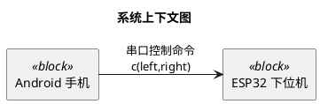

# PlantUML Safe Patterns

## Basic Style

Use plain PlantUML that renders reliably on the public server:



Do not set local fonts with `skinparam defaultFontName`.
The public PlantUML server may not have the same fonts as the user's computer.

## SysML-Like Stereotypes

PlantUML does not implement full SysML notation, so use UML elements plus stereotypes:

- `rectangle "Name" as X <<block>>`
- `rectangle "REQ-001\n中文需求" as R1 <<requirement>>`
- `interface "串口控制接口" as Serial <<interfaceBlock>>`
- `rectangle "安全约束" as Limit <<constraint>>`
- `rectangle "速度指令" as Speed <<valueType>>`

Prefer `rectangle` for requirements when render reliability matters.
Use `class` only when the diagram clearly benefits from class-like compartments.

## Chinese Labels

Use Chinese for all human-facing diagram text:

```plantuml
title 安全状态机
state "本地搜索" as LOCAL_SEARCH
LOCAL_SEARCH --> HARD_STOP : 搜索超时\n发送 STOP
```

Keep English only for established technical tokens such as `OpenBot`, `Android`, `ReID`, `STOP`, `LOCAL_SEARCH`, `TargetTrackManager`, and file names.

## Avoid Server 400 Syntax

Avoid raw angle-bracket examples inside labels:

```plantuml
' Risky
Phone --> MCU : c<left,right>

' Safer
Phone --> MCU : c(left,right)
Phone --> MCU : c&lt;left,right&gt;
```

Avoid deep HTML labels, unbalanced quotes, and very long single-line labels.
Use `\n` for short line breaks and split large diagrams into multiple files.

Avoid these optional settings unless there is a specific reason:

```plantuml
skinparam defaultFontName <local font name>
skinparam linetype ortho
```

## Links

PlantUML `/uml/` links are created by deflating the PUML text and encoding it with PlantUML's custom alphabet.
Use `scripts/plantuml_links.py` instead of hand-building links.
