# 第2周 SysML 建模：功能、逻辑与物理架构

> 本文档用于落实课程第 2 周“系统功能架构、逻辑架构、物理架构（SysML 建模）”任务。  
> 建模内容基于仓库现有主文档与已确认工程决策，在上周需求、用例、初步架构的基础上做进一步拆解细化。

## 1. 建模依据与范围

本次建模优先依据以下项目文档：

1. [design/structure.md](/D:/作业(homework)/系统创新实践/shopping%20car/design/structure.md)
2. [design/OpenBot与四驱麦轮AT8236下位机适配风险说明.md](/D:/作业(homework)/系统创新实践/shopping%20car/design/OpenBot与四驱麦轮AT8236下位机适配风险说明.md)
3. [design/background/05-chassis-mcu-and-safety.md](/D:/作业(homework)/系统创新实践/shopping%20car/design/background/05-chassis-mcu-and-safety.md)
4. [design/background/02-openbot-platform.md](/D:/作业(homework)/系统创新实践/shopping%20car/design/background/02-openbot-platform.md)

当前采用的首版工程口径如下：

- 上位机主脑：Android 手机 + OpenBot App
- 下位机主控：ESP32
- 电机执行板：AT8236 四路编码器电机驱动板
- 机械平台：305 系列四驱麦轮底盘
- 首版控制抽象：**按差速跟随模型工作**
- 首版通信策略：**优先 USB Serial**
- 首版安全策略：目标丢失取消前进、短时原地搜索、超时停车、急停优先、通信超时停车

说明：

- 物理底盘是四驱麦轮，但首版不把“横移 / 全向自主控制”作为必做能力。
- 为保持与 OpenBot 原生链路兼容，首版逻辑上仍以 `ctrl_left` / `ctrl_right` 为核心控制量，再映射到四个车轮。
- 仓库当前以 Markdown 为主，因此下文采用 **Mermaid 表达 SysML 等价视图**，重点体现结构、行为、分配和追踪关系。

---

## 2. 从上周成果到本周建模的细化关系

上周已经完成了：

- 场景分析
- 功能需求 / 非功能需求
- 用例分析
- 初步功能模块
- 初步总体架构
- WBS / 里程碑 / 甘特图

本周不是推翻重做，而是在这些内容上继续细化为：

- 功能层：系统必须做什么，功能如何分解
- 逻辑层：这些功能由哪些逻辑组件协同完成，接口和数据如何流动
- 物理层：这些逻辑组件最终落到哪些真实软硬件部件和连接关系上

---

## 3. 功能架构

### 3.1 顶层功能分解图

```mermaid
flowchart TD
    A["自主跟随购物车系统"]

    A --> F1["F1 手动遥控与模式切换"]
    A --> F2["F2 目标检测、锁定与跟随"]
    A --> F3["F3 安全保护与异常停车"]
    A --> F4["F4 底盘执行与运动控制"]
    A --> F5["F5 结构承载与载物集成"]
    A --> F6["F6 状态反馈、参数配置与测试支持"]

    F1 --> F11["进入手动模式"]
    F1 --> F12["前进 / 后退 / 转向 / 停止"]
    F1 --> F13["切换到跟随 / 停止模式"]

    F2 --> F21["采集前向视频"]
    F2 --> F22["检测画面中的 person"]
    F2 --> F23["初始化目标并锁定"]
    F2 --> F24["估计目标相对位置"]
    F2 --> F25["生成左右轮控制目标"]

    F3 --> F31["目标丢失判定"]
    F3 --> F32["LOST/SEARCH/STOP 状态管理"]
    F3 --> F33["障碍减速或停车"]
    F3 --> F34["通信超时停车"]
    F3 --> F35["物理急停与急停锁定"]

    F4 --> F41["解析 OpenBot 控制指令"]
    F4 --> F42["左右控制量映射到四轮"]
    F4 --> F43["向 AT8236 下发目标速度"]
    F4 --> F44["驱动四路编码器电机"]

    F5 --> F51["购物筐 / 载物平台固定"]
    F5 --> F52["机械限位与防滑"]
    F5 --> F53["磁吸辅助定位与快拆"]
    F5 --> F54["重心与稳定性控制"]

    F6 --> F61["显示模式和连接状态"]
    F6 --> F62["调整跟随距离 / 速度参数"]
    F6 --> F63["记录测试结果与异常状态"]
```

### 3.2 功能用例图

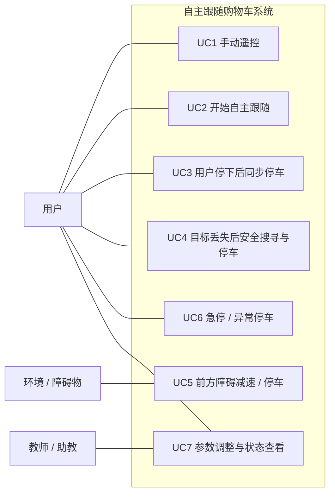

### 3.3 跟随与安全核心活动图

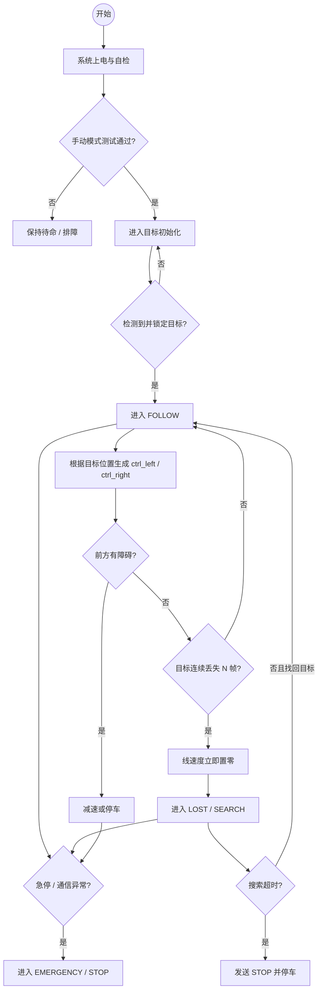

### 3.4 功能层结论

功能层回答的是“系统要做什么”。  
相较上周初版功能模块，这一层已经进一步明确了：

- 跟随闭环不是单一“检测 + 控制”，而是“初始化 - 跟随 - 目标丢失 - 搜索 - 停车”的受限行为链
- 安全功能不再只是附属条目，而是与跟随功能并列的顶层功能
- 结构集成也作为系统功能的一部分纳入建模，而不是仅作为机械实现细节

---

## 4. 逻辑架构

### 4.1 逻辑模块分解图

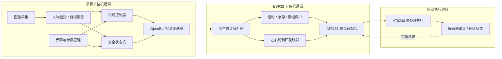

### 4.2 逻辑数据流与接口图

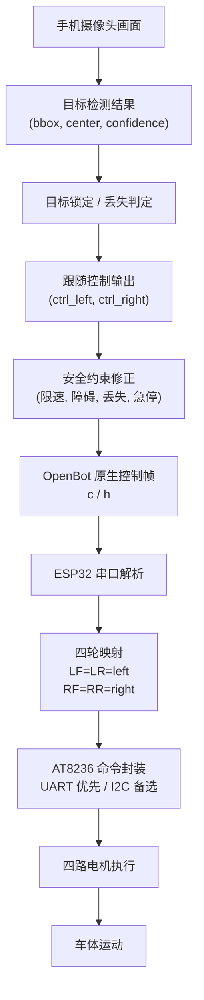

### 4.3 逻辑状态机图

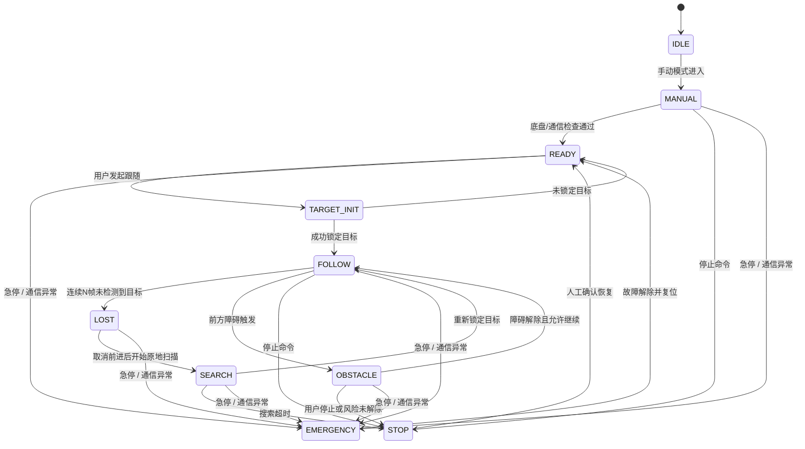

### 4.4 逻辑层结论

逻辑层回答的是“系统如何组织实现这些功能”。  
这一层的关键工程判断是：

- Android 手机负责感知、跟随决策和交互
- ESP32 负责协议解析、安全保护和执行协调
- AT8236 负责四路电机具体驱动与编码器采集
- 首版保持 OpenBot 原生控制语义不变，只在 ESP32 内部做四轮映射与安全增强

也就是说，首版的核心不是改造手机端协议，而是把 AT8236 和四驱底盘**包进 OpenBot 兼容逻辑里**。

---

## 5. 物理架构

### 5.1 物理组成框图

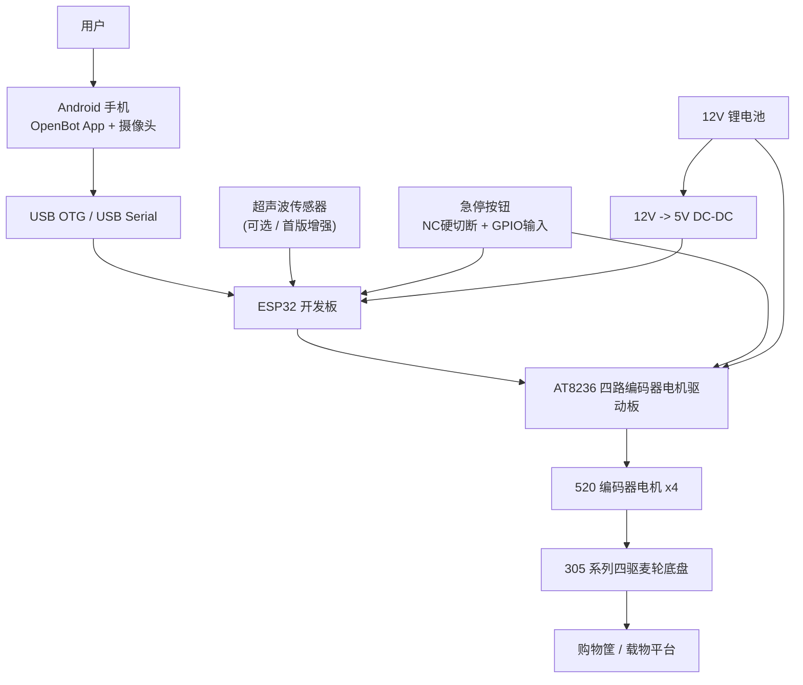

### 5.2 物理接口与部署关系图

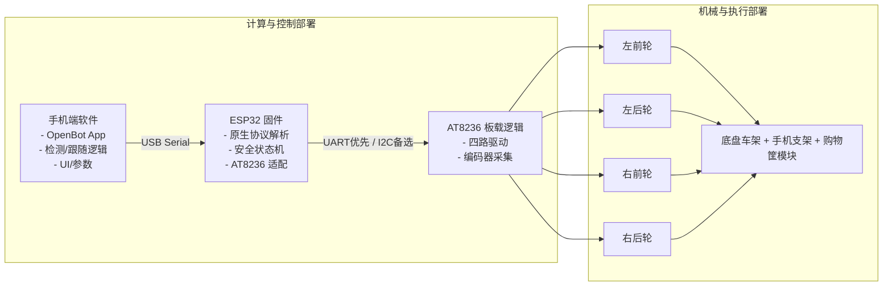

### 5.3 电源与安全拓扑图

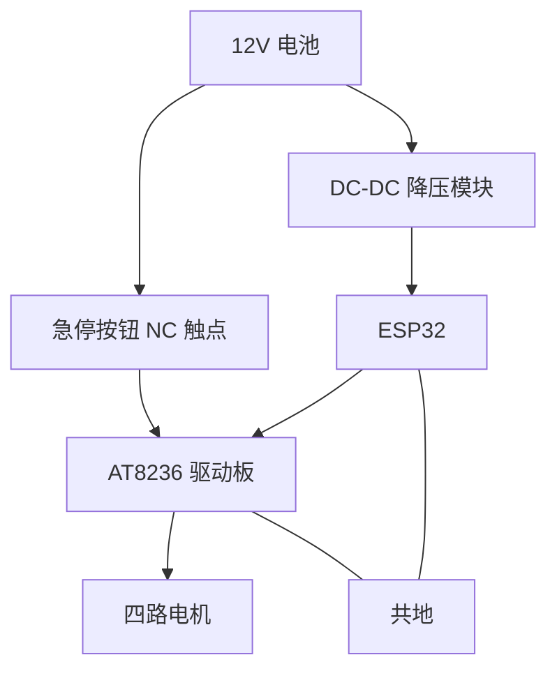

### 5.4 物理层结论

物理层回答的是“系统最终由什么构成，怎样连接部署”。  
和上周的总体框图相比，这一层新增并明确了：

- 手机、ESP32、AT8236 三者的具体职责边界
- 四驱麦轮底盘在首版中按照左右分组差速运行
- 电机电源与逻辑电源分开考虑
- 急停必须同时具备**硬切断**与**软件上报**两条路径
- 购物筐模块是被系统架构显式包含的物理部件，不是后加附件

---

## 6. 需求到架构的追踪关系

### 6.1 功能需求追踪表

| 需求 | 对应功能 | 关键逻辑模块 | 关键物理部件 | 验证方式 |
|---|---|---|---|---|
| FR-01 手动遥控 | F1 手动遥控与模式切换 | UI、指令发送器、协议解析器、四轮映射 | 手机、USB OTG、ESP32、AT8236、底盘 | T1 手动遥控 |
| FR-02 目标锁定 | F2 目标检测与锁定 | 图像采集、人物检测、目标锁定 | 手机摄像头、手机端 App | 目标初始化测试 |
| FR-03 自主跟随 | F2 + F4 | 跟随控制器、四轮映射、驱动适配 | 手机、ESP32、AT8236、电机、底盘 | T3/T4/T5 |
| FR-04 购物筐集成 | F5 结构承载与载物集成 | 结构集成逻辑 | 底盘、支架、购物筐、限位件、磁吸件 | T8/T9 |
| FR-05 目标丢失安全搜寻与停车 | F3 安全保护 | 丢失判定、安全状态机、超时保护 | 手机、ESP32、底盘 | T6 |
| FR-06 障碍停车 | F3 安全保护 | 障碍判断、安全状态机 | 超声波 / 视觉、ESP32、底盘 | T7 |
| FR-07 跟随参数可调 | F6 参数配置 | UI、参数管理、跟随控制器 | 手机端 App | 参数调节测试 |
| FR-08 状态显示与模式切换 | F1 + F6 | UI、状态机、日志反馈 | 手机端 App | 模式切换测试 |
| FR-09 快拆与维护 | F5 + F6 | 结构设计、测试记录逻辑 | 购物筐模块、限位件、固定件 | T9 |

### 6.2 非功能需求追踪表

| 需求 | 架构落实点 |
|---|---|
| NFR-02 安全性 | LOST/SEARCH/STOP 状态链、急停硬切断、通信超时停车、障碍停车 |
| NFR-03 可靠性 | USB Serial 优先、ESP32 负责本地保护、AT8236 执行层与上位机解耦 |
| NFR-04 实时性 | 手机上位机本地推理、USB 串口链路、ESP32 本地限幅与停车 |
| NFR-05 可维护性 | 手机 / ESP32 / AT8236 / 结构模块分层；购物筐模块快拆 |
| NFR-06 可展示性 | 手动、跟随、目标丢失、障碍、急停构成清晰演示闭环 |
| NFR-08 结构安全裕量 | 购物筐采用机械限位为主、磁吸为辅，重心与防滑纳入物理架构 |

---

## 7. 本项目适合采用的 SysML 图型

结合老师给出的示例和本项目当前复杂度，建议本项目第 2 周采用以下图型组合，而不是追求把所有 SysML 图都画满：

1. **功能架构**
   - 用例图
   - 功能分解图
   - 核心活动图

2. **逻辑架构**
   - 逻辑模块分解图
   - 逻辑数据流 / 内部接口图
   - 状态机图

3. **物理架构**
   - 物理组成框图
   - 物理接口与部署图
   - 电源与安全拓扑图

4. **需求追踪**
   - 需求到功能 / 逻辑 / 物理 / 测试的追踪表

这样做的好处是：

- 与课程要求直接对齐
- 与当前仓库的已有内容一致
- 既能展示 SysML 思路，又不会脱离你们实际工程状态
- 后续第 3 周继续细化时，可以直接把这里的图往测试、参数和接口定义方向扩展

---

## 8. 需求验证、确认方法与参数基线

这一部分对应老师第 5 页里提到的：

- 需求追溯
- 验证及确认方法
- 参数

这里不再停留在“架构应该如此”，而是把架构和后续联调、测试、演示直接接起来。

### 8.1 需求验证与确认矩阵

| 需求 | 验证类型 | 验证方法 | 对应测试 | 通过标准 |
|---|---|---|---|---|
| FR-01 手动遥控 | 实体运行 | 手动模式下执行前进、后退、左转、右转、停止 | T1 | 指令方向正确，停止可靠，无明显失控 |
| FR-02 目标锁定 | 实体运行 + 观察确认 | 用户站入初始化区域，检查能否稳定锁定目标 | 目标初始化测试 | 进入 FOLLOW 前目标锁定稳定，无明显误锁 |
| FR-03 自主跟随 | 实体运行 | 单人直线、转弯、停下三类场景测试 | T3/T4/T5 | 能低速连续跟随，不明显蛇形，不撞人 |
| FR-04 购物筐集成 | 实体运行 | 空载与 1-3 kg 负载条件下行驶和停车 | T8/T9 | 结构不松动、不明显偏移、不倾覆，可重复拆装复位 |
| FR-05 目标丢失安全搜寻与停车 | 实体运行 + 视频复核 | 遮挡或离开画面制造目标丢失 | T6 | 丢失后立即取消前进，仅原地低速搜索，超时后停车 |
| FR-06 障碍停车 | 实体运行 | 前方放置静态障碍物，检查减速/停车 | T7 | 不接触障碍物，保留安全余量 |
| FR-07 跟随参数可调 | 配置验证 + 实体运行 | 修改关键参数并复测效果 | 参数调节测试 | 跟随距离、速度等参数修改后能生效 |
| FR-08 状态显示与模式切换 | 观察确认 | 切换手动 / 跟随 / 停止，查看状态反馈 | 模式切换测试 | 模式状态清晰，切换过程可控 |
| FR-09 快拆与维护 | 实体运行 | 拆装后重复进行低速直行、转弯、急停测试 | T9 | 购物筐重复定位稳定，固定结构不明显滑移 |
| NFR-02 安全性 | 实体运行 + 视频计时 | 急停、丢失目标、通信断开、障碍等专项测试 | T2/T6/T7 + 急停测试 | 所有异常场景下优先停车，不继续盲目前进 |
| NFR-03 可靠性 | 重复运行 | 多次重复演示闭环 | T10 | 不频繁掉线、不频繁崩溃，关键流程可复现 |
| NFR-04 实时性 | 观察确认 + 视频分析 | 记录检测到控制输出的响应感受和轨迹滞后 | 跟随专项测试 | 跟随无明显拖尾，停车响应及时 |
| NFR-05 可维护性 | 文档检查 + 实体复测 | 查看结构图、接线图、模块边界；拆装复测 | T9 | 模块边界清晰，结构和电控可维护 |
| NFR-06 可展示性 | 场景演示确认 | 按完整演示脚本执行一次 | T10 | 启动、跟随、停车、急停过程清晰可展示 |
| NFR-08 结构安全裕量 | 实体运行 | 转弯、急停、负载、重复拆装场景下观察载物结构 | T8/T9 | 磁吸不作为唯一承力，结构不脱落、不明显滑移 |

### 8.2 验证与确认方法分层说明

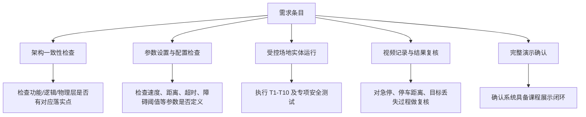

说明：

- **验证**偏向“系统是否满足技术要求”，例如停车是否发生、响应是否及时。
- **确认**偏向“系统是否满足课程和用户场景需求”，例如演示流程是否清晰、跟随体验是否自然。

对于本项目这类课程原型，最实际的确认方式不是复杂仿真，而是：

1. 受控室内场地的实体运行
2. 关键场景的视频留证
3. 完整演示脚本的重复执行

### 8.3 关键参数基线表

下表汇总了当前文档体系里已经出现并适合作为首版联调基线的参数。  
这些不是最终定值，而是“第 2 周设计输入 + 第 3 周联调起点”。

| 参数分类 | 参数名 | 当前建议值 / 口径 | 来源与说明 |
|---|---|---|---|
| 运动性能 | 跟随速度 | 0.3-0.8 m/s | 主文档性能指标；首版低速安全优先 |
| 运动性能 | 初始最大线速度 `V_MAX` | 0.5 m/s 初始，可上调至 0.8 m/s | 便于先稳后快 |
| 跟随策略 | 跟随距离 | 1.0-2.0 m 可调 | 与目标初始化距离及舒适跟随距离一致 |
| 跟随策略 | 目标初始化距离 | 约 1.0-2.0 m | 用户站入初始化区域进行目标锁定 |
| 跟随策略 | 横向控制 | P 控制优先 | 参数少，适合 4 周周期快速调优 |
| 跟随策略 | 距离控制 | 比例控制 / 分段控制 | 先实现简单稳定，再考虑更复杂控制 |
| 目标丢失 | `LOST_FRAMES` | 连续 N 帧未检测到目标 | 当前先按“连续多帧判定”口径，联调时具体定值 |
| 目标丢失 | `SEARCH_TIMEOUT` | 短时搜索后超时停车 | 搜索仅允许原地扫描，不允许继续前进 |
| 障碍安全 | `STOP_DISTANCE` | 30 cm | 已高于 OpenBot 原始 10 cm，符合购物车安全余量 |
| 急停安全 | 急停响应时间 | 不超过 0.5 s | 主文档明确性能指标 |
| 目标丢失安全 | 超时后停车完成时间 | 搜索超时后 1 s 内停车 | 主文档明确性能指标 |
| 通信 | 上位机-ESP32 链路 | USB Serial 优先 | 首版稳定性优先 |
| 通信 | OpenBot 原生串口参数 | 115200, 8N1 | 复用 OpenBot 原生口径 |
| 控制接口 | 上位机到下位机控制语义 | `c<left,right>` + `h<interval>` | 保持上位机零修改 |
| 执行机构 | 底盘控制抽象 | 左右差速 | 四驱麦轮首版按差速模式工作 |
| 电机参数 | 电机额定电压 | 12V | 已确认采购版本 |
| 电机参数 | 空载转速 | 320 rpm | 已确认减速比 30 版本 |
| 编码器参数 | `TICKS_PER_REV` 初始口径 | 330 | 减速后编码器线数，后续仍需实测校准 |
| 供电 | 电池到驱动板 | 12V 直供 | 驱动板工作范围内 |
| 供电 | ESP32 供电 | 12V -> 5V DC-DC | 与电机供电分开考虑，减小压降与干扰 |
| 结构 | 负载目标 | 购物筐 + 1-3 kg 物品 | 首版原型载物口径 |
| 演示 | 单次运行时间 | 不少于 20 min | 满电条件下连续演示测试目标 |

### 8.4 参数之间的约束关系

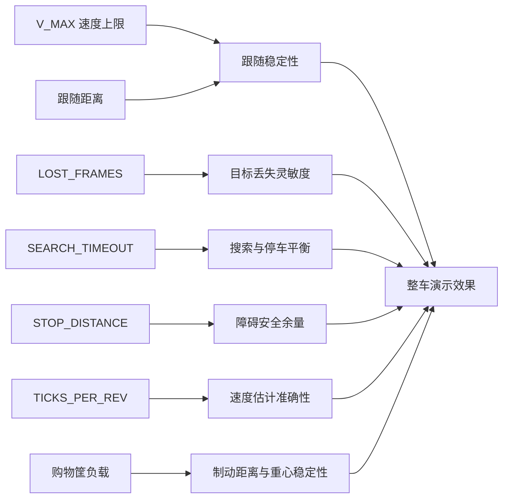

这个关系图表达了一个很重要的工程现实：  
你们后续联调不是在“单独调一个参数”，而是在平衡**跟随稳定性、安全性、结构稳定性、演示可重复性**。

### 8.5 第3周最先要落地的参数调试顺序

建议按下面顺序推进，而不是一开始同时调所有东西：

1. **先调基础链路**
   - 手动遥控方向
   - 左右轮映射方向
   - 停止是否可靠

2. **再调安全底线**
   - 急停
   - 通信超时停车
   - 障碍停车阈值

3. **再调跟随体验**
   - 目标初始化距离
   - 跟随距离
   - `V_MAX`
   - 横向转向灵敏度

4. **最后调目标丢失策略**
   - `LOST_FRAMES`
   - `SEARCH_TIMEOUT`
   - 原地搜索扫描速度

这样做可以避免“跟随没调稳”和“安全策略没锁住”互相干扰。

---

## 9. 下一步细化建议

如果继续向下展开，下一批最值得补充的是：

1. **需求图 / 需求表编号统一**
   - 把 FR/NFR/测试编号在所有文档中统一

2. **ESP32 内部软件结构图**
   - 串口解析
   - 安全状态机
   - AT8236 适配器
   - 轮速映射

3. **手机端跟随算法细化图**
   - 目标初始化
   - 目标保持
   - 丢失判定
   - 搜索恢复

4. **物理接线图**
   - 供电
   - 串口
   - 急停
   - 超声波

5. **验证矩阵**
   - 需求 -> 测试编号 -> 测试方法 -> 通过标准

这些内容会自然承接到第 3 周的联调与验证任务。
